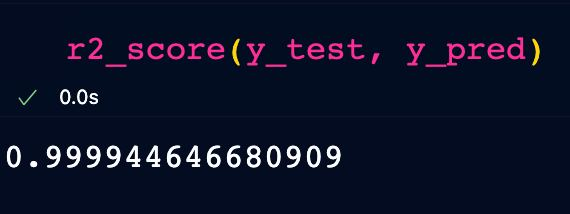
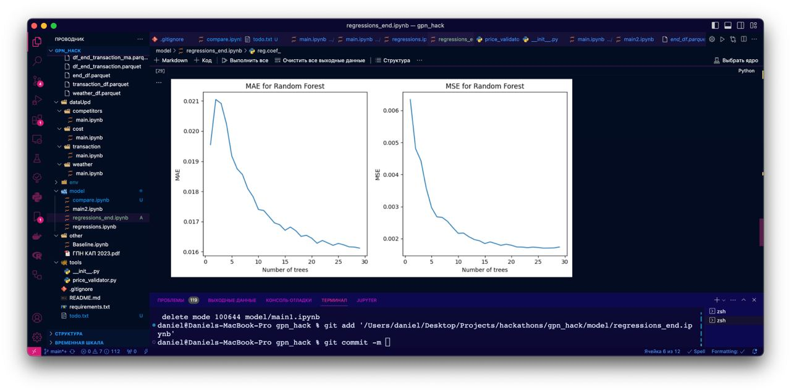

# gpn_hack

## Комментарии по коду

- в dataUpd содержится анализ и обработка данных нам датасетов(в каждой папке лежит обработка каждого из датасета(по названию))
- в model/main2.ipynb превратили итоговой датасет в более удобный формат для обучения модели(или написания алгоритма)
- В model/regressions_end.ipynb модель регрессии, которая обучается на предобработанных данных из end_df.ipynb
- В tools/ и model/compare.ipynb находятся валидаторы проверки всех перечисленных условий задачи.

## Описание решения

Обрабатываем датасет:

- указываем всю информацию о ценах в разных компаниях(включая нашу), обычной цены и погоде в различных местах для различного товара и в определенный день
- ищем нелинейные коэффициенты, которые возможно понадобятся нам при обучении(или написания алгоритма), добавляем в датасет

Пишем валидатор, который, на основе предсказаний, переделывает все в соответствии с тз:

Обучаем линейную регрессию на наших данных

Прогоняем наши предсказания через регресиию, чтобы итог соответствовал тз

## Продолжение к идее. Максимизация прибыли.

Идеи максимализации прибыли для нашего решения:

- Смещение price на +-1, если это позволено(пока соответствует тз)
- Методы максимизации(minimize для -price\*amount)

## Гипотезы и основные идеи, на которых основано наше решение

Изучив графики стандартных цен и цен в магазинах, был сделан вывод, что цены растут практически линейно вверх. Таким образом, обычная линейная модель может дать достаточно хороший результат. Т.к. коэффициент прироста небольшой, можно спокойно провалидировать наш предикт под соответствие тз(наклонная прямая может состоять из кусочных горизонтальных прямых с высотой больше/меньше на 1 чем было). Теперь остается единственная проблема: Цена у конкурентов - ведь не хочется сердить Высшие Силы. Поэтому, наша модель должна показывать хороший accuracy, выявив закономерности с данного нам датасета...

## Итог

